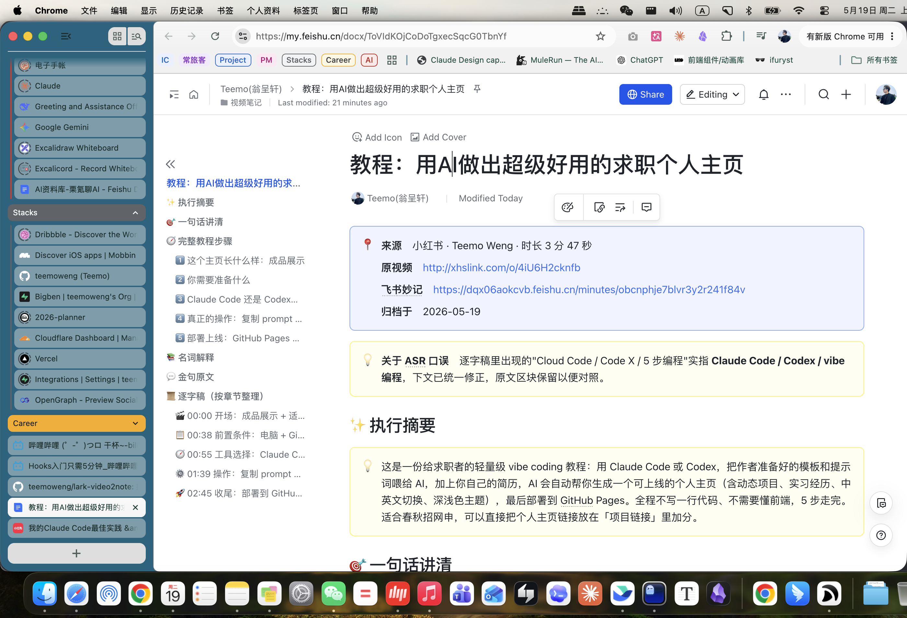
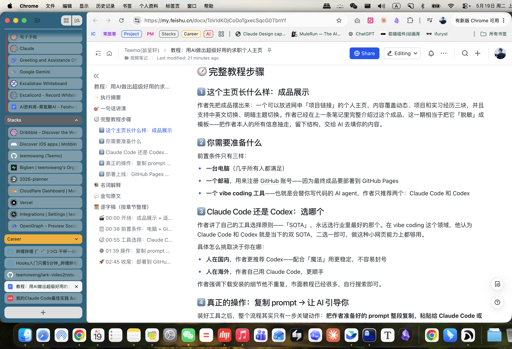
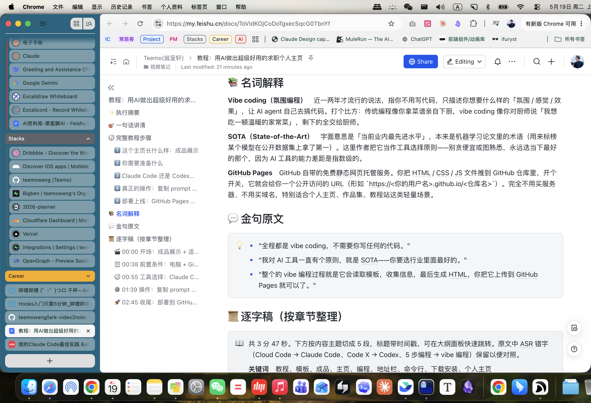

# lark-video2note

> 一个 Claude Code skill：把**视频链接**（抖音 / 哔哩哔哩 / 小红书 / YouTube）一键转成**飞书结构化笔记**——含执行摘要、完整论证链路、Demo 详解、名词解释、金句和分章节逐字稿，自动归档到飞书云盘。
>
> 替代 Get 笔记的飞书原生方案，专为重度飞书 + Claude Code 用户设计。

> _A Claude Code skill that turns Douyin/Bilibili/Xiaohongshu/YouTube video links into rich, structured notes in Lark (Feishu) Docs. Lark-specific — heads-up for international readers._

---

## 它能干什么

把任意一条视频链接（含分享口令文本），自动转成飞书里**逐字稿 + 妙记 + 结构化文档**三件套，归档到云盘指定文件夹。

结构化文档包含：

- 📍 来源信息（蓝色高亮块）
- ✨ 执行摘要（黄色高亮块，3-5 行讲清作者想说啥）
- 🎯 核心论点（一句话立场）
- 🧭 完整论证链路（4-6 段叙述 + 必要 bullet）
- 🎬 Demo 实操（如果视频里有）
- 📚 名词解释（用大白话 + 类比，只解释真正生僻的）
- 💬 金句原文（≤ 3 句）
- 📜 逐字稿（按章节切分，带时间戳跳转）

### 示例

**Input**（小红书短视频，3 分 47 秒）：

```
http://xhslink.com/o/4iU6H2cknfb 教程：用AI做出超级好用的求职个人主页🌟
```

**Output**（飞书文档）：

> 📄 [教程：用AI做出超级好用的求职个人主页 — 完整笔记](https://my.feishu.cn/docx/ToVIdKOjCoDoTgxecSqcG0TbnYf)

> 📋 配套飞书妙记（含逐字稿原文）：[obcnphje7blvr3y2r241f84v](https://dqx06aokcvb.feishu.cn/minutes/obcnphje7blvr3y2r241f84v)

文档实际渲染效果（4 张截图）：

| 块 | 截图 |
|---|---|
| 标题 + 来源信息 + 执行摘要 |  |
| 完整教程步骤（叙述段落 + 适度 bullet） |  |
| 名词解释 + 金句原文 |  |
| 逐字稿（按章节切分，带 emoji + 时间戳） |  |

---

## 工作原理

```
URL 输入
  ├─ download.sh             下载 mp4
  │   ├─ 抖音：iesdouyin.com 解析 play_addr（绕开 cookies）
  │   ├─ 哔哩哔哩 / YouTube / 小红书：yt-dlp
  │   └─ 非视频内容 → exit 2 → 主动建议改用 defuddle skill
  │
  ├─ get-captions.sh         尝试抓平台字幕
  │   ├─ 拿到（B站 AI 字幕 / YouTube auto-captions）→ 直接进 Claude 写文档
  │   └─ 没拿到 → 走飞书妙记 ASR 兜底
  │
  ├─ 飞书妙记（兜底）         lark-cli minutes +upload，等 ASR 完成拉逐字稿
  │
  ├─ Claude 撰写              基于逐字稿按 11 块结构化模板写飞书 docx XML
  │                          （不直接复用妙记自带的 AI 总结，密度太低）
  │
  └─ lark-cli docs +create   落地到飞书云盘，返回 URL
```

**字幕优先**意味着 B站 / YouTube 大多数视频 3-5 分钟出结果；只有抖音、小红书或没字幕的视频才走妙记（多花 8-15 分钟）。

---

## 安装

### 前置依赖

| 工具 | 用途 | 安装 |
|---|---|---|
| `lark-cli` | 飞书云盘 / 文档 / 妙记 API | `npm install -g @larksuite/cli` |
| `yt-dlp` | 视频下载 + 字幕抓取 | `brew install yt-dlp`（或 `pip install yt-dlp`） |
| `curl` | 抖音 share API | 系统自带 |
| `python3` | JSON 解析 / 字幕处理 | macOS 自带 / `brew install python` |
| Chrome 浏览器 | B站字幕 / 小红书 cookies 来源（需登录） | — |

### Skill 安装

把本 repo 作为 Claude Code 的 skill 安装到 `~/.claude/skills/lark-video2note/`：

```bash
git clone https://github.com/teemoweng/lark-video2note ~/.claude/skills/lark-video2note
cd ~/.claude/skills/lark-video2note
```

### 配置

跑首次配置向导：

```bash
bash scripts/setup.sh
```

向导会：

1. 检查依赖
2. 检查 lark-cli 登录态（缺 scope 会提示你跑 `lark-cli auth login`）
3. 让你选「让我建一个文件夹 / 我已经有 token」，把目标飞书云盘文件夹写进 `config.json`

需要的 lark-cli scope：

```
drive:drive
docs:document
minutes:minutes:readonly
minutes:minutes.artifacts:read
minutes:minutes.transcript:export
```

---

## 使用

在 Claude Code 里直接说：

```
帮我把这条视频转成笔记：https://www.bilibili.com/video/BV...
```

或者：

```
/video2note https://v.douyin.com/xxx/
```

Claude 自动跑下载 → 字幕/妙记 → 撰写 → 归档四步，返回飞书文档 URL。

---

## 推荐：全局 URL Triage 规则（可选）

如果你贴 URL 时**没加明确意图**（"转成笔记"、"留档"等动词），Claude 默认会按全局规则先 triage 再问你。

把下面这段贴进你的 `~/.claude/CLAUDE.md`，可以让 Claude 更聪明地判断是要 video2note、defuddle、还是别的处理路径：

```markdown
## URL 链接处理

当用户粘贴一条 URL（裸链接、分享口令、markdown 链接皆可），**但没有明确表达想做什么时**，按 `triage → ask → act` 三步走，不要贸然触发任何 skill：

1. **分诊**：先识别这是什么。能从 URL 模式直接判的就直接判：
   - 视频：`v.douyin.com` / `bilibili.com/video/` / `youtu.be` / `youtube.com/watch`
   - GitHub 资源：`github.com/.../pull/` / `issues/` / `commit/`
   - 网页文章：`mp.weixin.qq.com` / 一般博客域名
   - 不确定的（如 `xhslink.com` 既可能是视频也可能是图文）：用 curl HEAD 看 og:type 探一下。

2. **报告 + 询问**：一句话告诉用户看到的是什么，再列 2-3 个可能的下一步动作让用户选。

3. **执行**：仅在用户回应明确意图后，调用对应 skill。

**例外**：用户的同一条消息里如果已经包含明确动词（总结 / 整理 / 归档 / 留档 / 转笔记 / 翻译 …），直接执行，不要为了问而问。
```

---

## 已知限制

- **小红书**需要 Chrome 已登录小红书账号（脚本会自动读 cookies）
- **抖音的 share API** 偶尔会被风控，目前稳定但不保证未来不变
- **B站 AI 字幕**对专业术语 / 多人对话识别率比飞书妙记略低；如果质量明显差，可以手动改走妙记路径
- **40 分钟以上视频** 飞书 docs `--content` 一次性传可能超限，skill 会自动改用「骨架 + append」分段
- **本 skill 仅支持飞书生态**，不支持归档到 Notion / Obsidian / 本地 markdown 等

---

## 路线图

- [ ] 支持归档到本地 markdown 文件（无飞书账号的用户）
- [ ] 支持小宇宙 / Apple Podcasts 等播客平台
- [ ] 支持本地 mp4 / mp3 直接处理（绕过下载步骤）
- [ ] 长视频自动智能切章（不依赖逐字稿的时间戳）

---

## 协议

MIT License — 可商用、可修改、可二次分发。详见 [LICENSE](LICENSE)。

---

## 作者

Teemo Weng — [teemoweng.github.io](https://teemoweng.github.io)
